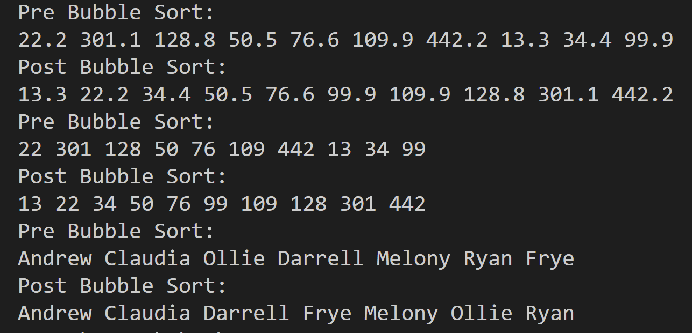
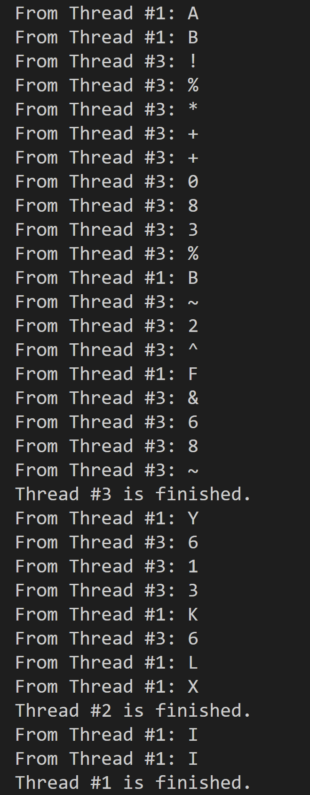
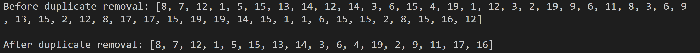

# AdvancedJavaConcepts

## Table of Contents
1. [JavaFXGUI](#JavaFXGUI)
2. [BubbleSort](#bubblesort)
3. [MultiThreading](#multithreading)
4. [ArrayListDupRemove](#arraylistdupremove)
5. [LambdaExpressions](#lambdaexpressions)
6. [IteratorVsGetMethod](#iteratorvsgetmethod)
5. [Developer Information](#developer-information)

## JavaFXGUI

**Instructions**

Assignment instructions: Write a program that displays various figures 
such as a Circle, a Rectangle, or an Ellipse. Include radio buttons 
selections for changing the display figure to the one selected. Include 
a checkbox for filling and clearing the displayed figure with a random color.

**Output**

Uncolored Circle                 |  Uncolored Ellipse               |  Uncolored Square
:-------------------------:|:-------------------------:|:-------------------------:
  |   | 

Colored Circle                 |  Colored Ellipse               |  Colored Square
:-------------------------:|:-------------------------:|:-------------------------:
  |   | 

**Technologies Used**
- Java/JavaFX
- JSON for configuration
- Visual Studio Code IDE

[Back to Table of Contents](#table-of-contents)

## BubbleSort

**Instructions**

Write a program with the two following generic methods using a bubble sort. The first method sorts the elements using 
the Comparable interface, and the second uses the Comparator interface.                                                     
                                                                                   
1. public static <E extends Comparable<E>> void bubbleSort(E[] list) {}              
2. public static <E> void bubbleSort(E[] list, Comparator<? super E> comparator) {}  
                                                                                     
Write test code that ensures the code functions correctly. 

**Output**

**Technologies Used**
- Java
- Visual Studio Code IDE

[Back to Table of Contents](#table-of-contents)

## MultiThreading

**Instructions**

Create a class titled <your first name here> ThreeThreads. Use three threads to 
output three types of characters to a text area for display.                        
                                                                                    
-	THREAD 1: output random characters like a, b, c, d, …                             
-	THREAD 2: output random digits like 0, 1, 2, 3, …                                 
- THREAD 3: output random characters like !, @, #, $, …                             
                                                                                                                  
Write test code that ensures the code functions correctly.

**Output**

**Technologies Used**
- Java
- Visual Studio Code IDE

[Back to Table of Contents](#table-of-contents)

## ArrayListDupRemove

**Instructions**

Write a test program that contains a static method that returns a new ArrayList. The new ArrayList returned will 
contain all original values with no duplicates from the original ArrayList. Fill the Original ArrrayList with 
50 random values from 1 to 20.

Write test code that ensures the code functions correctly.
 
**Output**

**Technologies Used**
- Java
- Visual Studio Code IDE

[Back to Table of Contents](#table-of-contents)

## LambdaExpressions

**Instructions**

Write a program that declares a method that takes an ArrayList as a parameter. Iterate through the ArrayList 
and print each element once with and once without Lambda Expressions.

Write test code that ensures the code functions correctly.
 
**Output**

**Technologies Used**
- Java
- Visual Studio Code IDE

[Back to Table of Contents](#table-of-contents)

## IteratorVsGetMethod

**Instructions**

Write a test program that stores 50,000 integers in LinkedList and test the time to traverse the list using 
an iterator vs. using the get(index) method. Then, test your program storing 500,000 integers. After 
completing this program and having tested both values, in your comments, explain the results and discuss 
the time taken using both values and their difference with the get(index) approach.

Write test code that ensures the code functions correctly.
 
**Output**

50,000 Elements with Iterator                 |  50,000 Elements with get(index)             
:-------------------------:|:-------------------------:
  |   

500,000 Elements with Iterator                 |  500,000 Elements with get(index)             
:-------------------------:|:-------------------------:
  |   

**Technologies Used**
- Java
- Visual Studio Code IDE

[Back to Table of Contents](#table-of-contents)

## Developer Information
Programmed by Andrew B. Schaefer [(Ab0213ab)](https://github.com/Ab0213ab).

LinkedIn: https://www.linkedin.com/in/andrewbschaefer/

Email: Abs233abs@gmail.com 

[Back to Table of Contents](#table-of-contents)
